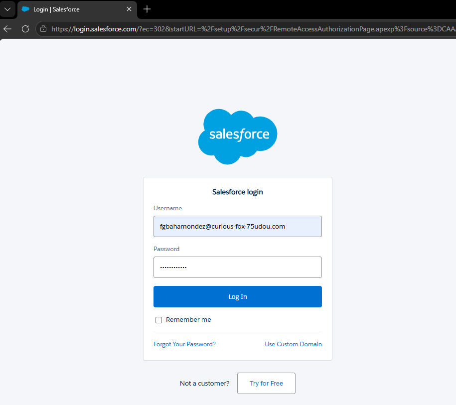
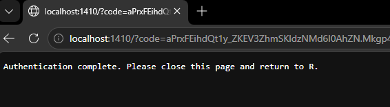

# Salesforce.org

## Integración

La primera tarea sería realizar la conexión con la plataforma, para eso vamos a utilizar lo siguiente:

### User + Token

```{r login, eval=FALSE}
## -----------------------------------------------------------------------------
login <- sf_auth()
```







```{r eval=FALSE, echo=FALSE}
# 2. POR SEGURIDAD: Reemplazamos el token real por un texto falso
login$token <- "Token Oculto por Seguridad"

# 3. Guardamos la lista en la nueva carpeta 'data'
saveRDS(login, file = "data/sf_login_mock.rds")
```


```{r echo=FALSE}
# Este bloque OCULTA el código (echo=FALSE), pero sí se ejecuta.
# Aquí es donde leemos el archivo que guardamos localmente en nuestro Paso 2.
login_guardado <- readRDS("data/sf_login_mock.rds")

# Imprimimos el resultado para que aparezca en el libro
str(login_guardado)
```
